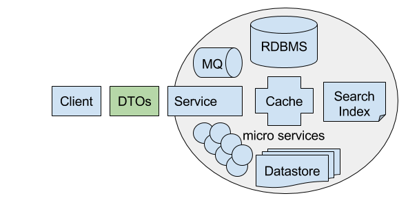
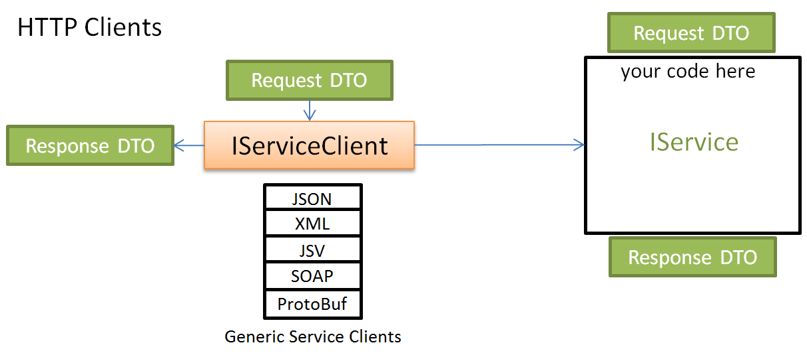
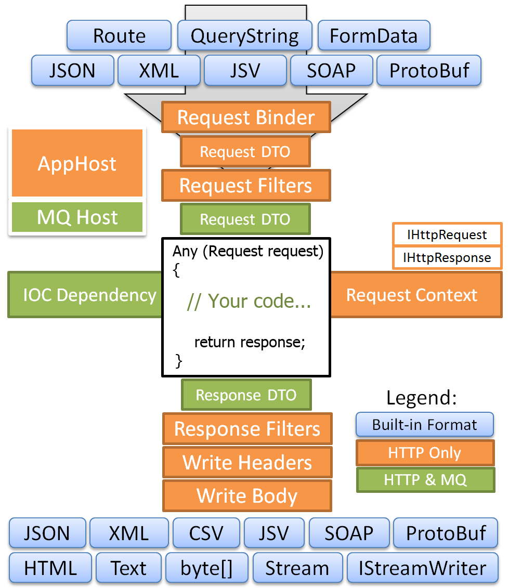
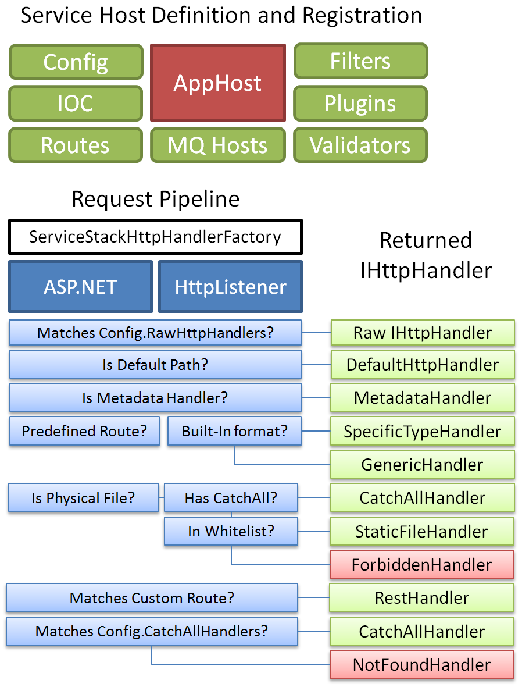
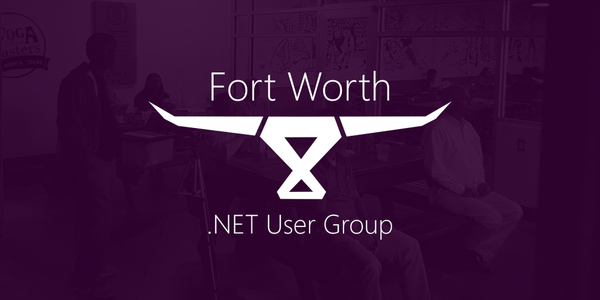

<!-- footer: ServiceStack - A Frictionless Development Framework  -->

#  

Frictionless Development Framework

---

# ME

# :boom: Write software :boom:

- **Trying** to **learn** and **improve** :thumbsup:
- **E-Mail**: <siliconrob@siliconheaven.net> :mailbox_with_mail:
- **Blog**: https://siliconheaven.info/ :orange_book:
- **GitHub**: https://github.com/Siliconrob 
- I have worked with ServiceStack in **production**

---

# What is it?

- Written by Demis Bellot <dev@servicestack.net>
- [.NET](https://dotnet.microsoft.com/) alternative **Web Framework+Ecosystem**
- **32,000,000+** downloads
- [Commercial license](https://servicestack.net/pricing) with **AGPL FOSS** license exception
- Service clients are **unrestricted**
- All source code is available on [GitHub](https://github.com/servicestack)

---

# Support and Resources

- [Documentation](https://docs.servicestack.net/): It is **great**
- [Customer Forums](https://forums.servicestack.net) - **New** questions/comments restricted to registered customers
- [User Voice](https://servicestack.uservoice.com/forums/176786-feature-requests): Feature Requests
- [StackOverflow](https://stackoverflow.com/search?q=servicestack)
- [Release Notes](https://docs.servicestack.net/release-notes-history): Comprehensive and detailed
---

# Key points

- **Message** based Architecture based on explicit Data Transfer Objects (**DTO**)
- **Runs** anywhere :runner:
- Works with your choice of **language+framework** :nut_and_bolt:
	- **Polyglots** welcome!
- [Documentation](https://docs.servicestack.net/)
- **Mature and supported**: **10+** years of development history
- **Growing** year over year and Demis is **always** on top of the hard code paths first for you

---

# Inspiration

- Be **productive**
- Value **composition** over **inheritance**
- Work with **Web** standards
- **Consistency**
- [Pipelines](https://docs.servicestack.net/order-of-operations)
- [Smalltalk](https://en.wikipedia.org/wiki/Smalltalk): [Message dispatching](https://stackoverflow.com/questions/982116/objective-c-message-dispatch-mechanism/982356#982356)

---
# Guiding Principles
- **Simplicity**: :one: + :one: = :two:
- **Performance** as feature :rocket:
- **Lightweight**: code first focus :muscle:
- **Testability**: Unit, Integration, Application :flashlight:
- **Message** based architecture: Coming back to this later :arrows_counterclockwise:
- **Convention** over **Configuration**

---
# Coarse grained API benefits



---
# Current Version
 - [v5.6](https://docs.servicestack.net/releases/v5.6) released 8/6/2019

 - Prereleases available on [MyGet](https://www.myget.org/F/servicestack)

### Release Notes
https://docs.servicestack.net/release-notes-history

---
# Request/Response flow


---

# Messaging

- **Every input** request DTO has a **corresponding response** DTO

## Request/Response
- Any DTO **object -> serialized** to Response ContentType DTO
- **HttpResult**, **HttpError**, **CompressedResult** (IHttpResult) for **Customized HTTP** response

---
# Why Message DTOs?

- Bind to intent not interface, single source of reference
- Service contracts are clear to both client and server developers from initial code reading
- Separated DTO contract allows for painless interchangeability and continues to honor external client contracts
- Internal pipeline processing structure is not dependent on external formats and presentations

---

# WebAPI
```
// GET api/values
[HttpGet]
public ActionResult<IEnumerable<string>> Get()
{
	return new string[] { "value1", "value2" };
}
```

---
# Messaging - Request/Response

### ServiceStack

This code should be in your distribution assembly i.e. **Model**

```
[Route("/api/values")]
public class ValuesRequest : IReturn<ValuesResponse>
{
}

public class ValuesResponse
{
    public List<string> Result { get; set; }
    public ResponseStatus ResponseStatus { get; set; }
}
```

---

# Messaging - Services

### ServiceStack

This code should be in your distribution assembly i.e. **Services**

```
public class ValuesService : Service
{
    public object All(ValuesRequest request)
    {
        return new ValuesResponse {
        	Result = new string[] { "value1", "value2" }
        };
    }
}
```
---
# Service Flow



---
# Request Pipeline


---
# Core Components

- **ServiceStack.Text**: **Free** from restrictions on use
- **ServiceStack.OrmLite**: **Dapper++**
- **ServiceStack.Caching**
- **ServiceStack.Redis**
- And many, many more are [available](https://servicestack.net/download)

---
# ServiceStack.Text
The all purpose Utility library
- **Text Serializers: (To|From}{JSON|JSV|CSV}**
- **AutoMapping**: **{PopulateWith|PopulateWithNonDefaultValues}**
- **HTTP**: **{Get|Post}{DataType}{From|To}Url**
- **Dump**: All purpose debug/log methods
- String Extensions, Collection extensions, Reflection Utils and lots more.

---
# ServiceStack.OrmLite
Key points extends **IDbConnection**
- Familiar Dapper like syntax
- **1** Class <-> **1** Table
- Database agnostic
- Best **feature** missing from Dapper `CreateTableIfNotExists<T>`

---
# ServiceStack.Caching
Provides a common ICacheClient that is pluggable to your choice of cache
- Memory: Concurrent Dictionary
- Redis: The **Best**
- OrmLiteCacheClient: To you current database
- Memcached
- AWS Dynamo
- Azure Table Storage

---
# ServiceStack.Redis
1 liner to get safe, static type access to **Redis**
`container.Register<IRedisClientsManager>(c => new RedisManagerPool(redisConnectionString));`

- Not that different from **StackExchange.Redis** at this level
- BUT the plugin capability of `IRedisTypedClient<T>` means generic CacheClient comes for **free**

---

# Helpful Tips

- Assemblies are **units of deployment NOT** logical boundaries
- Keep your model assembly **small** and **dependency free**
- Message DTOs **should** only contain serializable fields **NOT** behavior
- User extension methods to **extend+modify** concrete DTO behaviors
- Pipelining behavior in a Fluent functional manner is **good**
- Remember that HTTP is underlying all functionality

---

# Routing

## Explicit

1. Any exact Literal Matches are used first
2. Exact Verb match is preferred over All Verbs
3. The more variables in your route the less weighting it has
4. Routes with wildcard variables have the lowest precedence
5. When Routes have the same weight, the order is determined by the position of the Action in the service or Order of Registration (FIFO)

---
# Routing Example
`GET /content/v1/literal/slug`

## Route order evaluations

```
[Route("/content/v1/literal/slug", "GET")]
[Route("/content/v1/literal/slug")]
[Route("/content/v1/literal/{ignore}", "GET")]
[Route("/content/{ignore}/literal/{ignore}", "GET")]
[Route("/content/{Version*}/literal/{Slug*}", "GET")]
[Route("/content/{Version*}/literal/{Slug*}")]
[Route("/content/{Slug*}", "GET")]
[Route("/content/{Slug*}")]
```
---
# Do you want to hear about?

- `Funq`: Container
- `#Script`
- `Message Queues`

---
# Build Something

- `dotnet tool install --global web`
- 

---
# Thank you 

[Fort Worth .NET User Group](https://www.meetup.com/FWDNUG/) and [TekSystems](https://www.teksystems.com)



[Presentation](https://github.com/Siliconrob/presentations/tree/master/servicestack)